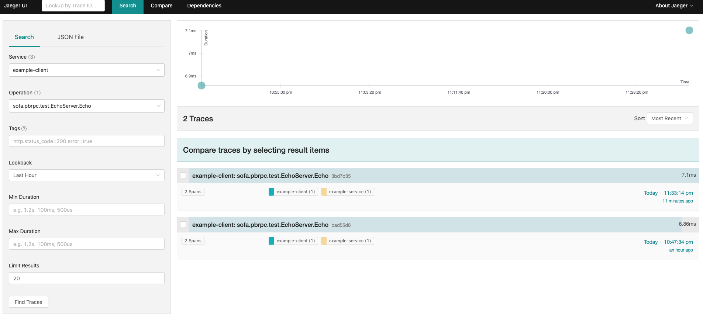
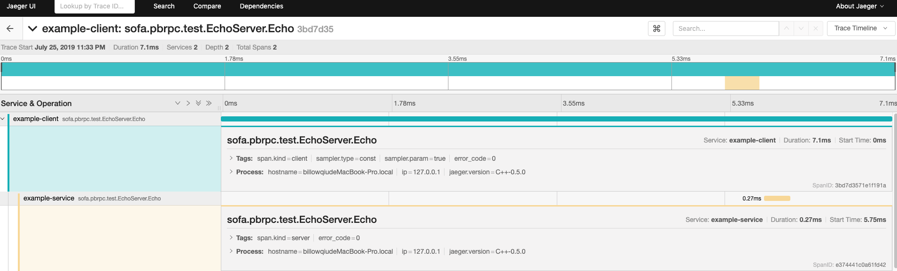

sofa-pbrpc
==========

A light-weight RPC implementation of Google's protobuf RPC framework.

Wiki: https://github.com/baidu/sofa-pbrpc/wiki

### Features
* High performace.
* Easy to use. Refer to sample code in './sample'.
* Supports sync call and async call. Refer to './sample/echo'.
* Supports three level (service/method/request) timeout. Refer to './sample/timeout_sample'.
* Supports transparent compression. Refer to './sample/compress_sample'.
* Supports mock test. Refer to './sample/mock_sample'.
* Supports network flow control.
* Supports auto connecting and reconnecting.
* Supports keep alive time of idle connections.
* Supports statistics for profiling.
* Supports multi-server load balance and fault tolerance.
* Supports http protocol.
* Provides web monitor.
* Provides python client library.
* Supports [opentracing](https://opentracing.io/) with [Jaeger](https://www.jaegertracing.io/) backend

### Dependencies
This lib depends on boost(only need header), protobuf3, snappy and zlib:
* boost - http://www.boost.org/
* protobuf - http://code.google.com/p/protobuf/
* snappy - http://code.google.com/p/snappy/
* zlib - http://zlib.net/

ATTENTION: boost header is only needed when compiling the lib, but is not needed for user code.

Extrally, './unit-test' and './sample/mock_sample' also depends on gtest:
* gtest - http://code.google.com/p/googletest/

### Build
- git clone https://github.com/billowqiu/sofa-pbrpc.git
- cd sofa-pbrpc
- git submodule update --init
- mkdir _build
- cd _build && cmake ..
- make

### Sample
For sample code, please refer to ['./sample'](https://github.com/baidu/sofa-pbrpc/tree/master/sample) and the wiki [Quick Start](https://github.com/baidu/sofa-pbrpc/wiki/%E5%BF%AB%E9%80%9F%E4%BD%BF%E7%94%A8).

### Profiling
For Profiling feature, please refer to the wiki [Profiling](https://github.com/baidu/sofa-pbrpc/wiki/Profiling%E5%8A%9F%E8%83%BD).

### Performance
For performace details, please refer to the wiki [Performance](https://github.com/baidu/sofa-pbrpc/wiki/%E6%80%A7%E8%83%BD).

### Implementation
For implementation details, please refer to the wiki and file [doc/sofa-pbrpc-document.md](doc/sofa-pbrpc-document.md).

### Tracing
- Follow this [guide](http://billowqiu.github.io/2019/04/11/jaeger-practice/)
- cd _build
- cp ../sample/echo/config.yml .
- ./echoserver 
- Open an new terminal, ./echoclient_async
- Open http://127.0.0.1:16686

### Support
opensearch@baidu.com
